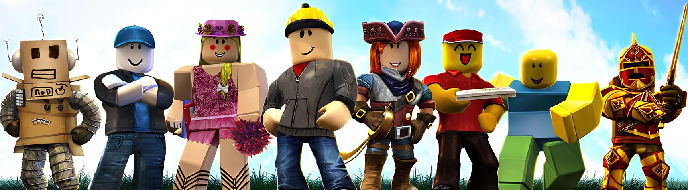

# Roblox Development Guides and Documentation

  

 
This repository serves as a centralized collection of documentation, guides, and best practices for developing games on the Roblox platform.

The guides cover essential scripting fundamentals in Luau, core usage of Roblox Studio, and setting up a professional, modular development workflow using Rojo.

## Guides

Jump directly into the documentation below:

### [Lua Fundamentals](./languages/lua.md)

- _A comprehensive guide to Lua programming basics and core concepts._

### [Roblox Studio & Luau Fundamentals](./engines/roblox/roblox-studio-luau-guide.md)

- _A foundational guide to the Roblox Studio environment and core concepts of the Luau scripting language._

### [Rojo Developer Workflow](./workflows/rojo-dev-workflow-guide.md)

- _A guide detailing the setup and usage of Rojo for external development, Git integration, and managing modular codebases._

## Getting Started

### Prerequisites

- This guide assumes prior programming fundamentals knowledge.
- Core mathematics knowledge for game development.
- Basic familiarity with the game engine.

### Recommended Reading Order

1. Lua Fundamentals
2. Roblox Studio & Luau Fundamentals
3. Rojo Developer Workflow
